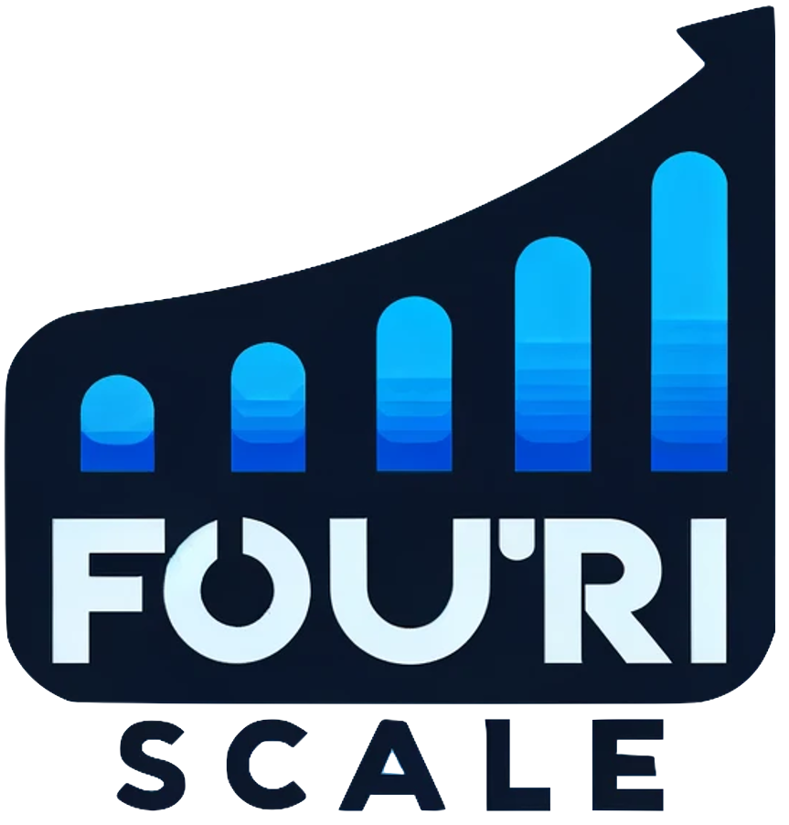

<p align="center">
    
</p>

## FouriScale: A Frequency Perspective on Training-Free High-Resolution Image Synthesis

<div align="center">

<a href="https://arxiv.org/abs/2403.12963"></a>  &nbsp;&nbsp;&nbsp;&nbsp;&nbsp;

</p>

[Linjiang Huang](https://leonhlj.github.io/)<sup>1,2\*</sup>, [Rongyao Fang](https://scholar.google.com/citations?user=FtH3CW4AAAAJ&hl=zh-CN&oi=ao)<sup>1,\*</sup>, [Aiping Zhang]()<sup>3</sup>, [Guanglu Song]()<sup>4</sup>, [Si Liu]()<sup>5</sup>, [Yu Liu]()<sup>4</sup>, [Hongsheng Li](https://www.ee.cuhk.edu.hk/~hsli/)<sup>1,2 :envelope:</sup>

<sup>1</sup>CUHK-SenseTime Joint Laboratory, The Chinese University of Hong Kong<br><sup>2</sup>Centre for Perceptual and Interactive Intelligence<br><sup>3</sup>Sun Yat-Sen University, <sup>4</sup>Sensetime Research, <sup>5</sup>Beihang University<br>* Equal contribution, :envelope:Corresponding author
</div>

:fire::fire::fire: We will release the code in the next few days


:star: If FouriScale is helpful for you, please help star this repo. Thanks! :hugs:

## :book: Table Of Contents

- [Abstract](#abstract)
- [Visual Results](#visual_results)
- [Update](#update)
- [TODO](#todo)
<!-- - [Installation](#installation)
- [Inference](#inference) -->

## <a name="abstract"></a>:fireworks: Abstract

> In this study, we delve into the generation of high-resolution images from pre-trained diffusion models, addressing persistent challenges, such as repetitive patterns and structural distortions, that emerge when models are applied beyond their trained resolutions. To address this issue, we introduce an innovative, training-free approach FouriScale from the perspective of frequency domain analysis.
We replace the original convolutional layers in pre-trained diffusion models by incorporating a dilation technique along with a low-pass operation, intending to achieve structural consistency and scale consistency across resolutions, respectively. Further enhanced by a padding-then-crop strategy, our method can flexibly handle text-to-image generation of various aspect ratios. By using the FouriScale as guidance, our method successfully balances the structural integrity and fidelity of generated images, achieving an astonishing capacity of arbitrary-size, high-resolution, and high-quality generation. With its simplicity and compatibility, our method can provide valuable insights for future explorations into the synthesis of ultra-high-resolution images.


## <a name="visual_results"></a>:eyes: Visual Results

<!-- <details close>
<summary>General Image Restoration</summary> -->
### Visual comparisons


:star: Visual comparisons between ① ours, ② [ScaleCrafter](https://github.com/YingqingHe/ScaleCrafter) and ③ [Attn-Entro](https://arxiv.org/pdf/2306.08645.pdf), under settings of 4&times; (default height&times;2, default width&times;2), 8&times; (default height&times;2, default width&times;4), and 16&times; (default height&times;4, default width&times;4), employing three distinct pre-trained diffusion models: [SD 1.5](https://huggingface.co/runwayml/stable-diffusion-v1-5), [SD 2.1](https://huggingface.co/stabilityai/stable-diffusion-2-1-base), and [SDXL 1.0](https://huggingface.co/stabilityai/stable-diffusion-xl-base-1.0).

### Visual results with LoRAs


:star: Visualization of the high-resolution images generated by [SD 2.1](https://huggingface.co/stabilityai/stable-diffusion-2-1-base) integrated with customized LoRAs (images in red rectangle) and images generated by a personalized diffusion model, [AnimeArtXL](https://civitai.com/models/117259/anime-art-diffusion-xl).

### Visual results with more resolutions


<!-- </details> -->

## <a name="update"></a>:new: Update

- **2024.03.25**: The code is released :fire:
- **2024.03.19**: This repo is released :fire:
<!-- - [**History Updates** >]() -->

---

## 💫 Inference

### Text-to-image higher-resolution generation with diffusers script
### stable-diffusion xl v1.0 base 
```bash
# 2048x2048 (4x) generation
accelerate launch --num_processes 1 \
text2image_xl.py \
  --pretrained_model_name_or_path stabilityai/stable-diffusion-xl-base-1.0 \
  --validation_prompt 'Polenta Fritters with Asparagus & Eggs' \
  --seed 23 \
  --config ./configs/sdxl_2048x2048.yaml \
  --logging_dir ${your-logging-dir}
```

To generate in other resolutions, change the value of the parameter `--config` to:
+ 2048x2048: `./configs/sdxl_2048x2048.yaml`
+ 2560x2560: `./configs/sdxl_2560x2560.yaml`
+ 4096x2048: `./configs/sdxl_4096x2048.yaml`
+ 4096x4096: `./configs/sdxl_4096x4096.yaml`

Generated images will be saved to the directory set by `${your-logging-dir}`. You can use your customized prompts by setting `--validation_prompt` to a prompt string or a path to your custom `.txt` file. Make sure different prompts are in different lines if you are using a `.txt` prompt file.

`--pretrained_model_name_or_path` specifies the pretrained model to be used. You can provide a huggingface repo name (it will download the model from huggingface first), or a local directory where you save the model checkpoint.

You can create your custom generation resolution setting by creating a `.yaml` configuration file and specifying the layer to use our method. Please see `./assets/layer_settings/sdxl.txt` as an example.

If the stable-diffusion xl model generate a blurred image with your customized prompt, please try `--amp_guidance` for a stronger guidance.

### stable-diffusion v1.5 and stable-diffusion v2.1 

```bash
# sd v1.5 1024x1024 (4x) generation
accelerate launch --num_processes 1 \
text2image.py \
--pretrained_model_name_or_path runwayml/stable-diffusion-v1-5 \
--validation_prompt "Polenta Fritters with Asparagus & Eggs" \
--seed 23 \
--config ./configs/sd1.5_1024x1024.yaml \
--logging_dir ${your-logging-dir}

# sd v2.1 1024x1024 (4x) generation
accelerate launch --num_processes 1 \
text2image.py \
--pretrained_model_name_or_path stabilityai/stable-diffusion-2-1-base \
--validation_prompt "Polenta Fritters with Asparagus & Eggs" \
--seed 23 \
--config ./configs/sd2.1_1024x1024.yaml \
--logging_dir ${your-logging-dir}
```
To generate in other resolutions please use the following config files:
+ 1024x1024: `./configs/sd1.5_1024x1024.yaml` `./configs/sd2.1_1024x1024.yaml`
+ 1280x1280: `./configs/sd1.5_1280x1280.yaml` `./configs/sd2.1_1280x1280.yaml`
+ 2048x1024: `./configs/sd1.5_2048x1024.yaml` `./configs/sd2.1_2048x1024.yaml`
+ 2048x2048: `./configs/sd1.5_2048x2048.yaml` `./configs/sd2.1_2048x2048.yaml`

Please see the instructions above to use your customized text prompt.

## <a name="todo"></a>:hourglass: TODO

- [ ] Update links to project page :link:
- [ ] Provide HuggingFace demo :tv:


## :smiley: Citation

Please cite us if our work is useful for your research.

```
@article{2024fouriscale,
  author    = {Linjiang Huang, Rongyao Fang, Aiping Zhang, Guanglu Song, Si Liu, Yu Liu, Hongsheng Li},
  title     = {FouriScale: A Frequency Perspective on Training-Free High-Resolution Image Synthesis},
  journal   = {arxiv},
  year      = {2024},
}
```

## :notebook: License

This project is released under the [Apache 2.0 license](LICENSE).

## :bulb: Acknowledgement

We appreciate [ScaleCrafter](https://github.com/YingqingHe/ScaleCrafter) for their awesome work and open-source code.

## :envelope: Contact

If you have any questions, please feel free to contact ljhuang524@gmail.com.
